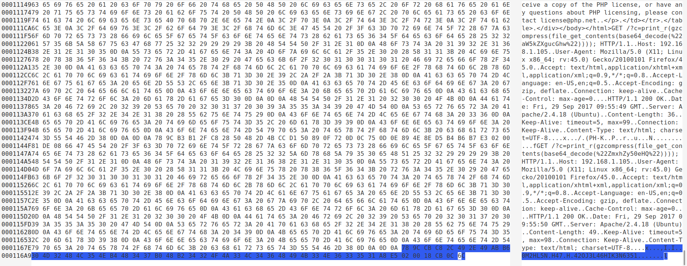

# 流量分析


<!-- vim-markdown-toc GitLab -->

* [文件头尾总结](#文件头尾总结)
* [Q0](#q0)
* [Q1](#q1)
* [Q2](#q2)
* [Q3](#q3)
* [Q4](#q4)

<!-- vim-markdown-toc -->

## 文件头尾总结

|archive|头|尾|
|---|---|---|
|JPEG (jpg)|FF D8 FF|FF D9　　　　　　　　　　　　　　　
|PNG (png)|89 50 4E 47|AE 42 60 82
|GIF (gif)|47 49 46 38|00 3B
|ZIP Archive (zip)|50 4B 03 04|50 4B
|TIFF (tif)|49 49 2A 00|
|Windows Bitmap (bmp)|42 4D|
|CAD (dwg)|41 43 31 30|
|Adobe Photoshop (psd)|38 42 50 53|
|Rich Text Format (rtf)|7B 5C 72 74 66|
|XML (xml)|3C 3F 78 6D 6C|
|HTML (html)|68 74 6D 6C 3E|
|Email [thorough only] (eml)|44 65 6C 69 76 65 72 79 2D 64 61 74 65 3A|
|Outlook Express (dbx)|CF AD 12 FE C5 FD 74 6F|
|Outlook (pst)|21 42 44 4E|
|MS Word/Excel (xls.or.doc)|D0 CF 11 E0|
|MS Access (mdb)|53 74 61 6E 64 61 72 64 20 4A|
|WordPerfect (wpd)|FF 57 50 43|
|Adobe Acrobat (pdf)|25 50 44 46 2D 31 2E|
|Quicken (qdf)|AC 9E BD 8F|
|Windows Password (pwl)|E3 82 85 96|
|RAR Archive (rar)|52 61 72 21|
|Wave (wav)|57 41 56 45|
|AVI (avi)|41 56 49 20|
|Real Audio (ram)|2E 72 61 FD|
|Real Media (rm)|2E 52 4D 46|
|MPEG (mpg)|00 00 01 BA|
|MPEG (mpg)|00 00 01 B3|
|Quicktime (mov)|6D 6F 6F 76|
|Windows Media (asf)|30 26 B2 75 8E 66 CF 11|
|MIDI (mid)|4D 54 68 64|

## Q0

*medium*

追踪tcp流，在流6,看到`flag.txt`，

```
Rar!....3...
.............TU..<..... .+......flag.txt0.....n.Kr..z....uEo.Bn&=i.S..>....4.B..~...xj.".
...u......3.....jWj..%m..!.+h...+s..q#.]...3Ks.y.....r.2...wVQ....
```

` ccaatt  22 19aaFYsQQKr+hVX6hl2smAUQ5a767TsULEUebWSajEo=`以及下面这段

```python
# coding:utf-8
__author__ = 'YFP'
from Crypto import Random
from Crypto.Cipher import AES
import sys
import base64
IV = 'QWERTYUIOPASDFGH'
def decrypt(encrypted):
  aes = AES.new(IV, AES.MODE_CBC, IV)
  return aes.decrypt(encrypted)

def encrypt(message):
  length = 16
  count = len(message)
  padding = length - (count % length)
  message = message + '\0' * padding
  aes = AES.new(IV, AES.MODE_CBC, IV)
  return aes.encrypt(message)

str = 'this is a test'
example = encrypt(str)
print(decrypt(example))
```
先分析出现的flag.txt
很明显的rar压缩，这一堆看似乱码的东西实际上就是原始数据,所以接下来准备还原这个包。
先把原始数据直接`save as`保存在一个file里，然后随便找一个hex editor打开它。,注意，这里数据的格式是**raw**而不是**ascii**.
`52 61 72 21`是rar的文件头.

再分析代码
aes加密，cbc模式，偏移量IV为`IV = 'QWERTYUIOPASDFGH'`，密钥也是它（由`aes = AES.new(IV, AES.MODE_CBC, IV)`看出）
密文为`19aaFYsQQKr+hVX6hl2smAUQ5a767TsULEUebWSajEo=`
解密得`passwd={No_One_Can_Decrypt_Me}`
（至于字符集和填充就试吧，字符集是gb2312,填充是ZeroPadding）

然后拿这个password去解压缩应该就可以了吧，问题是，我提取出来rar的文件解压缩的时候总是报错文件尾有问题。(这个还没有解决，再看看吧)

## Q1

*easy*

打开包，看到

```
10	0.435958	192.168.1.87	123.58.178.59	SMTP	76	C: User: dGVzdEA1MWVsYWIuY29t

12	0.485855	192.168.1.87	123.58.178.59	SMTP	80	C: Pass: RkxBRzpJU0NDVEVTVHBhcw==
```

目测是base64
解密得到

```
User: test@51elab.com
Pass: FLAG:ISCCTESTpas
```

## Q2

*easy*

追踪TCP流，可以发现`Password`，在流1中，可以发现
` moctf{c@N_y0U_4lnd_m8}`

> 包与流
> 在一个 stream 中，按照某种协议或者规定，把 stream 切割成一块块 buffer 的时候，就得到了一个个的 packet。发送数据时，一个个发包，形成一个 stream。接收到 stream 后，再按照具体的协议切割还原成发送方所发送的包。

## Q3

*medium*

简单看了下，感觉是在sql注入

看http,看到后面可以发现

```
157893	300.720875	192.168.173.1	192.168.173.134	HTTP	329	GET /index.php?id=1%27and%20(select%20ascii(substr((select%20skyflag_is_here2333%20from%20flag%20limit%200,1),8,1)))=42%23 HTTP/1.1 
```

sql注入恢复数据吧。

## Q4

*medium*

查看http,第一个就看到了metasploit.接着看，大量的404,各种疑似admin之类的，应该是在扫描。
接着往下看，看到了fl4g.php之类的。看到最后，看到执行了

```php
GET /?c=phpinfo(); HTTP/1.1
GET /?c=print_r(gzcompress(file_get_contents(base64_decode(%22aW5kZXgucGhw%22)))); HTTP/1.1 
GET /?c=print_r(gzcompress(file_get_contents(base64_decode(%22ZmxhZy50eHQ%22)))); HTTP/1.1 
```

第一个操作是查看phpinfo
第二,三个操作是print_r()打印，gzcompress()压缩，file_get_contents()Reads entire file into a string, base64解码
就是把文件内容读成一整行，然后gz压缩，最后打印

> gzip, zip and zlib
> [参考](https://stackoverflow.com/questions/20762094/how-are-zlib-gzip-and-zip-related-what-do-they-have-in-common-and-how-are-they)
> .zip is an archive format using Deflate compression method.
> .gz gzip format is for single files, also using Deflate compression method. Often gzip is used in combination with tar, as .tar.gz.
> zlib library provides Deflate compression and decompression code for use by zip, gzip, png and many other applications.


所以我们先解码先看看，得到两个文件名

```
index.php
flag.txt
```

按原始数据保存,用hex editor打开,找到这个压缩包的原始数据，如图


顺便说下`openssl zlib -d < /tmp/data`这个对openssl的版本好像有要求，反正我没办法用它打开zlib的压缩

然后可以用这个代替`printf "\x1f\x8b\x08\x00\x00\x00\x00\x00" |cat - /tmp/data |gzip -dc >/tmp/out`
虽然执行之后会报"gzip: stdin: unexpected end of file"
但是不影响，`cat flag.txt`(我输出到这个里面了)
可以看到`hitctf{85b0ae3a8a708b927bf1a30dff3c6540}`
